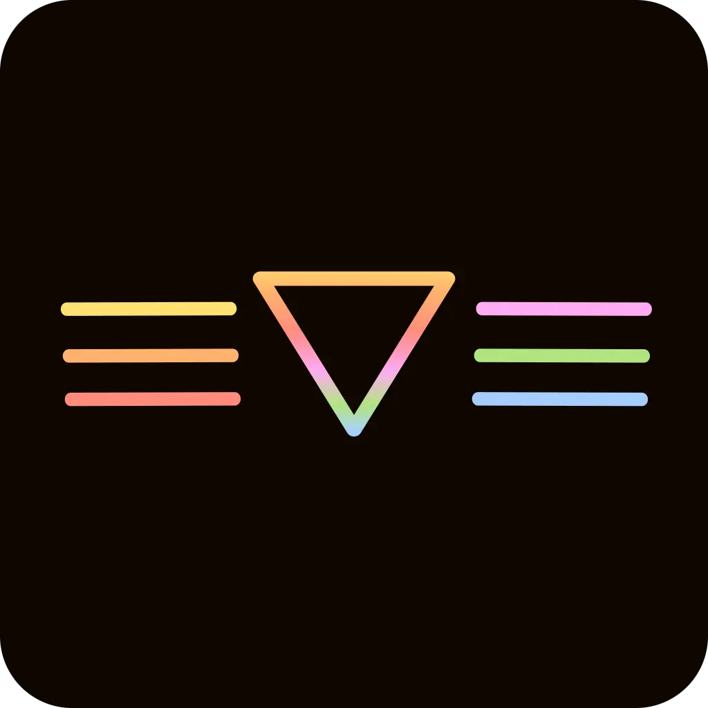

# Whiskers for VSCode

## TODO
- Test with more languages. Tested languages: [Rust, Python, Typescript, Json]
- Add other accent colors
- Fix status bar colors
- Script to build all the themes

## About
This theme is still in early stages so any help is appreciated. You can by either make an issue or push request languages that don't feel are correctly themed.  

## Previews
### 🐈‍⬛ Panther

### 🐅 Tiger

